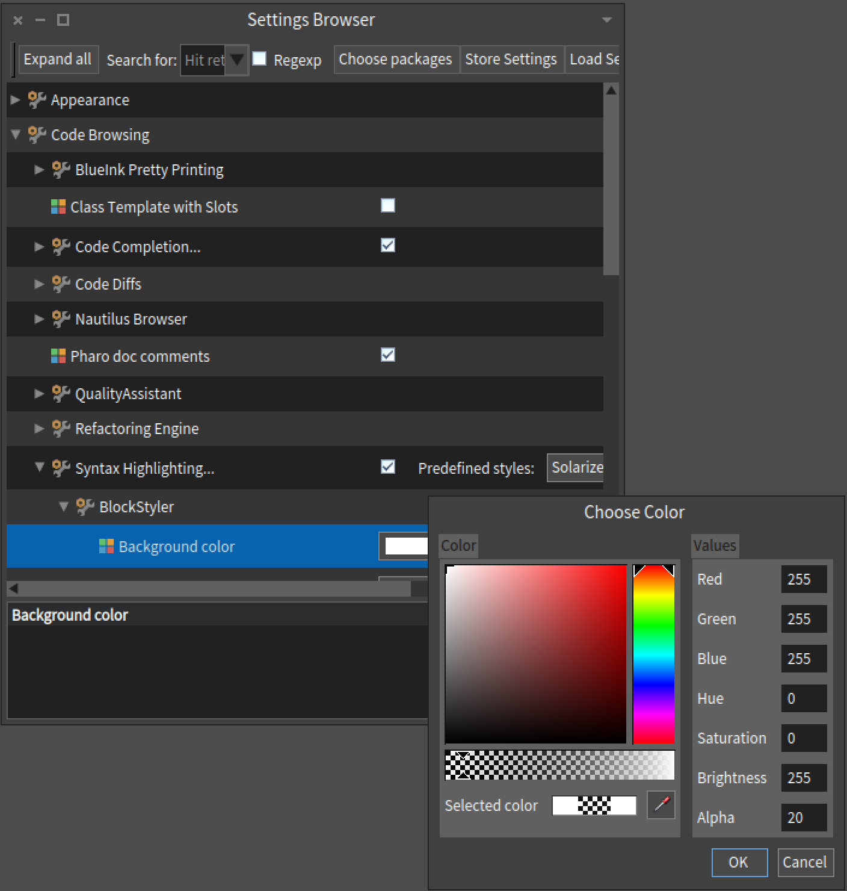

#BlockStyler

Highlights blocks to make them stand out more and detect nesting levels more easily.

##Demo


##Installation

Install with Metacello from GitHub.

```smalltalk
Metacello new
	baseline: 'BlockStyler';
	repository: 'github://maenu/BlockStyler';
	load
```

##Settings

You can set the highlight color with alpha using the settings browser under `Code Browsing > Syntax Highlighting > BlockStyler`


